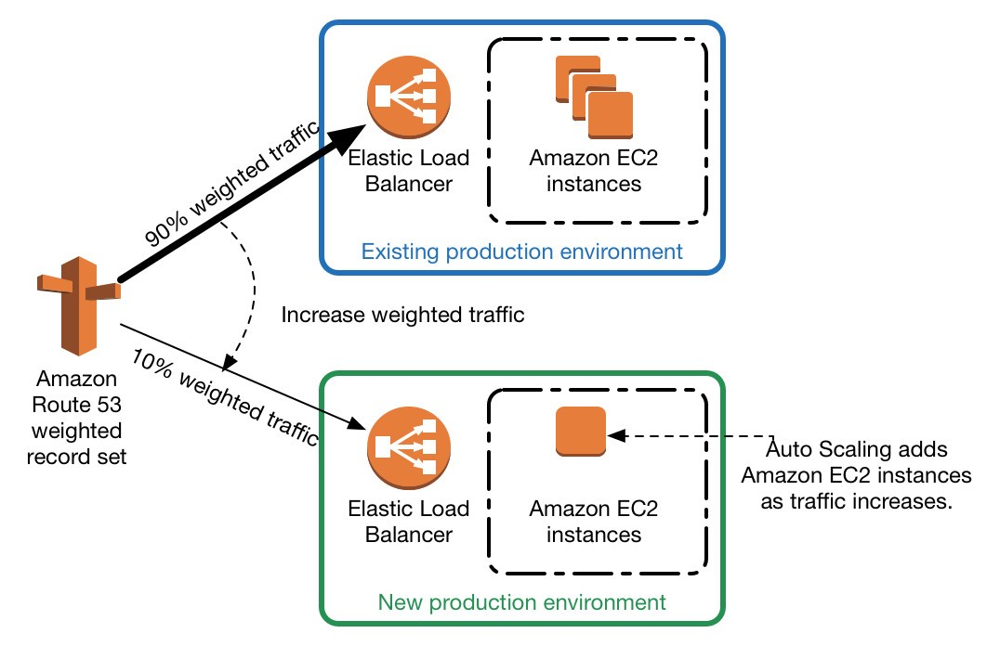

# aws-terraform

## Requirements

### Code

* bash + packer + terraform

* > :warning: **Prod enviroment doesn't work properly**: I still don't know.

* Simple bash script asking for enviroment(only two environments: **dev** and **prod**). During the process will ask some parameters:
    * amazon credentials
    * public key to propagate to autoscaling instances

```bash
./run.sh dev
```

## Considerations

* > :warning: **Prod enviroment doesn't work properly**: I still don't know.

* Only two environments (prod and dev).

* We use ELB instead of ALB because ALB required two differents zones so two differents subnetwork.

* We use routing (public subnet) instead of nat (private subnet)

* I use a single docker in each instance with the flag restat always in order to start when the instance start. No docker-compose is used.

* Always are used default values, but coud be changed in `.tfvars` file in spite of is not keeped in gitlab due to `.gitignore`

* Deploy in different workspaces using terraform

## Imprevements

* In case you have a dns server you could do an easy Blue/Green deployment



* Also you could use elb `test listeners` and `targets groups` in order to do Blue/Green deployment

* It could have been used any kind of orchestration system: docker-swarm, kubernetes,...
